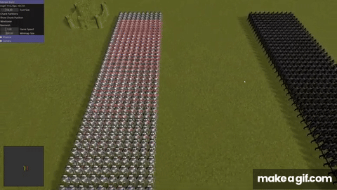

[English](README.md)

# 핸드메이드 RTS
  
스타크래프트는 언제나 제 마음속에 특별한 자리를 차지하고 있습니다.
제가 처음으로 게임 개발자가 되고 싶다는 꿈을 가지게 된 계기가 바로 이 게임이었습니다.
"이 모든 것은 내부적으로 어떻게 동작하는 걸까?"라는 질문을 제 마음속에 심어주었고,
그 호기심은 결국 하나의 도전으로 이어졌습니다. 바로 맨땅에서 RTS 게임을 만드는 것입니다.


## 빌드
#### Windows (MSVC cl x64)
프로젝트 루트 디렉터리에서 아래 명령을 실행
``` console
> b
```
릴리즈 빌드
``` console
> b release
```


## 영감을 받은 사람들
아래 분들에게 감사드립니다.
- [Casey Muratori](https://x.com/cmuratori)
- [Ryan Fleury](https://x.com/rfleury)
- [Jonathan Blow](https://x.com/Jonathan_Blow)
- [Sean Barrett](https://x.com/nothings)

이분들은 귀중한 지식을 공유하며 프로그래밍 생태계를 더 나은 방향으로 발전시키는 데 큰 역할을 하고 있습니다.

맨땅에서 직접 게임을 만들어보고 싶은 분이라면, Casey Muratori의 [Handmade Hero](https://guide.handmadehero.org/code/?utm_source=chatgpt.com) 를 강력히 추천합니다.


## 링크
[](https://www.youtube.com/@seongwoolee9919)
[](https://seongwoolee.com/ko/)
[](https://www.x.com/raylee9919)
