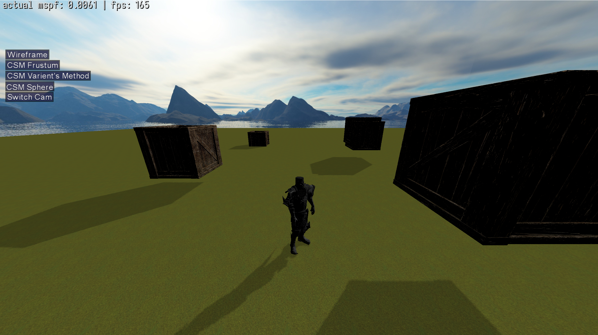

# Handmade RTS Engine
  
StarCraft has always held a special place in my heart. It was the game that first inspired me to dream of 
becoming a game developer. It planted a question in my mind, <i>how does this all work under the hood?</i> 
The curiosity eventually became a challenge I set myself: to build a handmade RTS engine from scratch.


## Build
#### Windows (MSVC cl x64)
``` console
> build.bat
```

#### Linux
``` console
$
```


## Inspired by
Thanks to these apex level programmers.
- [Casey Muratori](https://x.com/cmuratori)
- [Ryan Fleury](https://x.com/ryanjfleury)
- [Jonathan Blow](https://x.com/Jonathan_Blow)
- [Sean Barrett](https://x.com/nothings)

These people share invaluable knowledge on the internet and play a huge role in making the C/C++ ecosystem better.
For anyone looking to take the first step in building a game from scratch, I highly recommend Casey Muratori's renowned project, [Handmade Hero](https://guide.handmadehero.org/code/#).


## Links
[](https://www.youtube.com/@sungwoolee484)
[](https://www.x.com/raylee9919)
